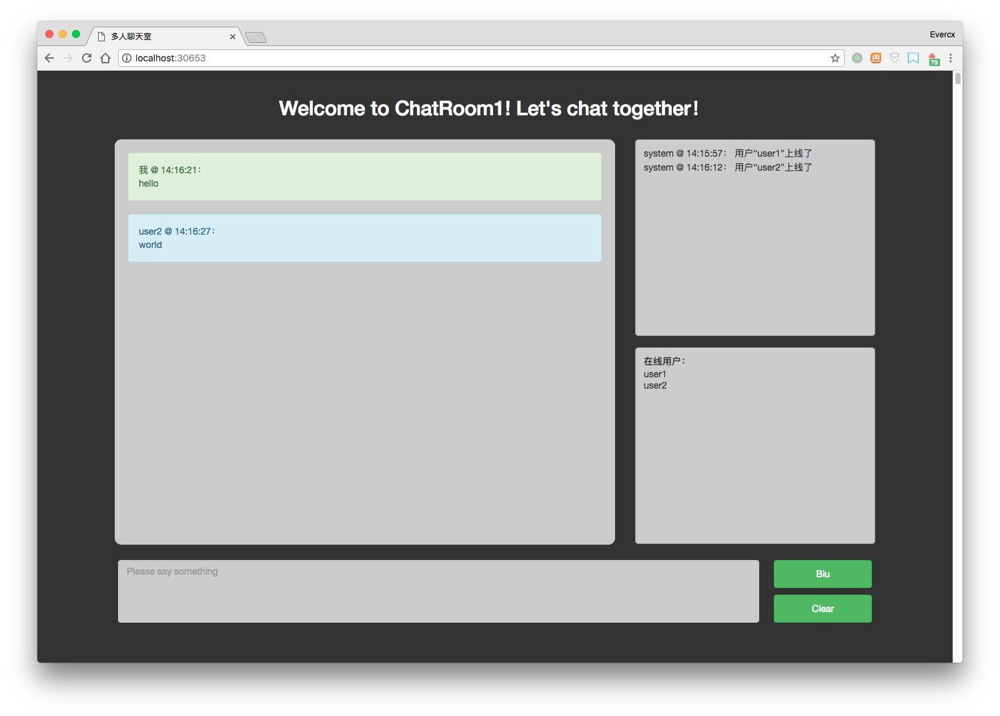

# chatTogether
## 简介

基于 Websocket 技术开发的在线多人聊天室

## 技术

后端：Express 框架 + [Socket.io](https://socket.io/)

前端：Bootstrap UI + jQuery

## 功能

目前的功能主要有：

- 多人在线聊天
- 多房间选择 (各房间聊天室独立)
- 在线用户列表
- 系统消息广播（用户上线与下线消息）

## 演示

## demo

[在线演示请点我](http://evercx.me:30653/)